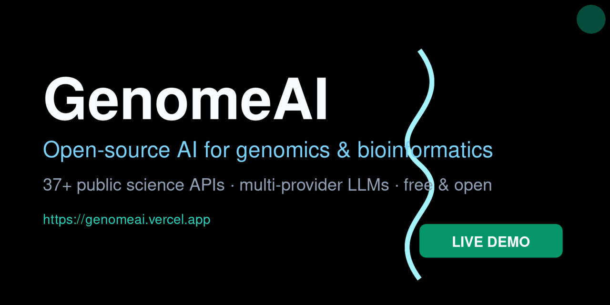

<p align="center">
  <a href="https://genomeai.vercel.app"></a>
  <a href="https://github.com/dsk-dev-ai/GenomeAI/stargazers"></a>
  <a href="https://github.com/dsk-dev-ai/GenomeAI/forks"></a>
</p>

<p align="center">
  <a href="https://github.com/dsk-dev-ai/GenomeAI/blob/main/LICENSE"></a>
  <a href="https://github.com/dsk-dev-ai/GenomeAI/actions"></a>
  <a href="https://github.com/dsk-dev-ai/GenomeAI/last-commit"></a>
  <a href="https://github.com/dsk-dev-ai/GenomeAI/issues"></a>
  <a href="https://github.com/dsk-dev-ai/GenomeAI/pulls"></a>
  <a href="https://github.com/sponsors/dsk-dev-ai"></a>
</p>

<h1 align="center">🧬 GenomeAI</h1>

<p align="center">
  <strong>Open-source AI platform for genomics, bioinformatics, biomedical research,<br/>and evidence-based AI powered by public scientific databases and multi-provider LLMs.</strong>
</p>

<p align="center">
  <a href=".github/genomeai-og.png"></a>
</p>

## 🚀 Live Demo

> **Try GenomeAI right now — no install required.** Click the link and use the
> working application:

<p align="center">
  <a href="https://genomeai.vercel.app"><strong>🌐 Open the Live Demo → https://genomeai.vercel.app</strong></a>
  <br/>
  <sub>Backend API: <code>https://genomeai-api.onrender.com</code> · free-tier hosts, deployed automatically on every release.
  See <a href="docs/deployment/releases.md">docs/deployment/releases.md</a> for how it works.</sub>
</p>

---

## What is GenomeAI?

GenomeAI is a unified platform that brings together **public biological databases**, **workflow automation**, **data visualization**, and **AI-powered analysis** — all in one open-source stack.

It connects directly to **18 free public APIs** (NCBI, Ensembl, UniProt, ClinVar, gnomAD, PDB, AlphaFold, ChEMBL, PubChem, Reactome, KEGG, STRING, OpenTargets, Monarch, Disease Ontology, DGIdb, Europe PMC, Semantic Scholar) to give researchers instant access to genomic, proteomic, chemical, and clinical data — without expensive licenses or proprietary infrastructure.

**Goal:** Make biomedical research accessible, reproducible, and AI-augmented for every researcher, clinician, and developer — anywhere in the world.

---

## Why GenomeAI?

| Problem | GenomeAI Solution |
|---------|-------------------|
| Biomedical data is scattered across 100+ databases | Unified connector layer — one API for all sources |
| Existing tools require expensive licenses | 100% open-source, runs on free-tier APIs |
| No integrated AI for genomic analysis | Multi-provider LLM support (Gemini cloud, Ollama local) |
| Workflows are manual and error-prone | DAG-based workflow engine with retry, scheduling, and parallel execution |
| Results are hard to visualize | Built-in genome browser, protein viewer, network graphs, scientific charts |
| Reproducibility is difficult | Versioned workflows, provenance tracking, audit logs |

---

## Features

### Built and Working

| Feature | Status |
|---------|--------|
| Biological domain models (Genome, Sample, Gene, Variant, Transcript, Protein, …) | ✅ |
| REST API with CRUD + enhanced analysis endpoints (24 route modules) | ✅ |
| Workflow DAG engine (definitions, steps, dependencies, validation) | ✅ |
| Deterministic, parallel DAG execution | ✅ |
| Cron-based workflow scheduler | ✅ |
| Queue & worker (Redis-backed background execution) | ✅ |
| Retry & failure handling (classification, backoff, policies) | ✅ |
| 18 real external-data connectors (NCBI, UniProt, ClinVar, gnomAD, …) | ✅ |
| AI-powered analysis (gene, variant, protein, drug, pathway, disease, literature, multi-domain report) with Gemini + Ollama | ✅ |
| Genome browser, protein viewer, network graphs, scientific charts, molecular structure | ✅ |
| Live demo — [genomeai.vercel.app](https://genomeai.vercel.app) | ✅ |

### Coming Next

| Feature | Phase |
|---------|-------|
| Knowledge graph (gene-disease-drug-protein associations) | 5 |
| More AI providers (OpenAI, Anthropic, Groq, Mistral) | 6 |
| PubMed/Europe PMC deep-dive literature QA | 6 |
| Plugin SDK and marketplace | 7 |
| Full-text ingestion workers (scheduled sync of source databases) | 7 |
| Authentication & multi-user organizations | 8 |

---

## Public Data Sources (Free APIs)

GenomeAI ships with **18 real connectors** to free public databases (implemented, live, and tested):

| Domain | Sources |
|--------|---------|
| **Genomic** | NCBI E-utilities, Ensembl (VEP) |
| **Protein** | UniProt, RCSB PDB, AlphaFold DB |
| **Drug/Compound** | ChEMBL, PubChem, DGIdb, Open Targets |
| **Literature** | Europe PMC, Semantic Scholar |
| **Pathway** | Reactome, KEGG |
| **Network** | STRING |
| **Variant** | ClinVar, gnomAD |
| **Disease** | Disease Ontology, Monarch, Open Targets |

See [docs/data-integration/](docs/data-integration/README.md) for the live
connectors and [docs/external-data/MASTER_PLAN.md](docs/external-data/MASTER_PLAN.md)
for the historical full integration plan (including future sources).

---

## Architecture

```
┌──────────────────────────────────────────────────────────────────┐
│                         User Interfaces                          │
│         CLI   |   REST API   |   Web UI   |   Python SDK         │
└──────────────────────────────┬───────────────────────────────────┘
                               │
┌──────────────────────────────┴───────────────────────────────────┐
│                     API Gateway (FastAPI)                        │
│           Auth  |  Rate Limiting  |  Validation  |  Audit        │
└──────────────────────────────┬───────────────────────────────────┘
                               │
┌──────────────────────────────┴───────────────────────────────────┐
│                      Orchestration Layer                         │
│  Workflow DAG Engine  |  Cron Scheduler  |  Redis Queue Worker   │
│  (parallel exec)      |  (scheduling)    |  (retry, backoff)    │
└──────────────────────────────┬───────────────────────────────────┘
                               │
┌──────────────┬───────────────┼───────────────┬───────────────────┐
│              │               │               │                   │
│  Biological  │   Data        │   AI/LLM      │   Visualization   │
│  Domains     │   Integration │   Gateway     │   Platform        │
│              │               │               │                   │
│  Genome      │   NCBI        │   Gemini     │   Genome Browser  │
│  Sample      │   Ensembl VEP │   Ollama     │   Protein Viewer  │
│  Gene        │   UniProt     │   (local)    │   Network Graphs  │
│  Variant     │   ClinVar     │              │   Scientific      │
│  Transcript  │   gnomAD      │              │   Charts          │
│  Protein     │   PDB/AlphaFold │            │   3D Molecular    │
│              │   ChEMBL/PubChem │           │                   │
│              │   Reactome/KEGG  │           │                   │
│              │   STRING/OpenTargets│         │                   │
│              │   EuropePMC/S2     │          │                   │
└──────────────┴───────────────┴───────────────┴───────────────────┘
                               │
┌──────────────────────────────┴───────────────────────────────────┐
│                          Storage Layer                            │
│           PostgreSQL  |  Redis  |  Object Storage                 │
└──────────────────────────────────────────────────────────────────┘
```

See [ARCHITECTURE.md](ARCHITECTURE.md) for the full technical breakdown.

---

## Quick Start

```bash
# Clone the repository
git clone https://github.com/dsk-dev-ai/GenomeAI.git
cd GenomeAI

# Install all dependencies and start infrastructure
make setup

# Run tests (over 2,150 passing)
make test

# Start the API server
uvicorn genomeai_api.main:app --reload
```

**Requirements:** Python 3.12+, Node.js 20+, PostgreSQL 16+, Redis 7+

See [docs/development/](docs/development/) for detailed setup guides.

---

## Tech Stack

| Layer | Technology |
|-------|-----------|
| API | Python 3.12, FastAPI, SQLAlchemy, Pydantic |
| Database | PostgreSQL 16+, Redis 7+ |
| Workflow Engine | Python asyncio, DAG execution, Redis queue |
| Frontend | Next.js, React, TypeScript, Tailwind CSS |
| Visualization | D3.js, Three.js, Cytoscape.js, Mol* |
| AI/LLM | Gemini (cloud, default `gemini-3.6-flash`), Ollama (local) |
| DevOps | Docker, GitHub Actions, Turbo (monorepo) |
| Testing | pytest (2,150+ tests), biome, ruff, pyright |

---

## Documentation

| Topic | Location |
|-------|----------|
| Architecture | [ARCHITECTURE.md](ARCHITECTURE.md) |
| Roadmap | [ROADMAP.md](ROADMAP.md) |
| API Reference | [docs/api/](docs/api/) |
| Database Schema | [docs/database/](docs/database/) |
| Workflow Engine | [docs/workflows/](docs/workflows/) |
| External Data & APIs | [docs/external-data/](docs/external-data/) |
| AI/ML Guide | [docs/ai/](docs/ai/) |
| Visualization | [docs/visualization/](docs/visualization/) |
| Decisions | [docs/decisions/](docs/decisions/) |
| Contributing | [CONTRIBUTING.md](CONTRIBUTING.md) |

---

## Contributing

We welcome contributions from bioinformaticians, software engineers, data scientists, and researchers.

See [CONTRIBUTING.md](CONTRIBUTING.md) for guidelines.

```bash
# Quick contribution workflow
git checkout -b feat/my-feature
make lint make typecheck make test
git commit -m "feat(domain): add my feature"
git push origin feat/my-feature
# Open a Pull Request
```

---

---

## Community

- **Live demo:** [genomeai.vercel.app](https://genomeai.vercel.app)
- **Discussions:** [GitHub Discussions](https://github.com/dsk-dev-ai/GenomeAI/discussions) — Q&A, ideas, show & tell
- **Issues:** [Report a bug](https://github.com/dsk-dev-ai/GenomeAI/issues/new?assignees=&labels=bug&template=bug_report.md) · [Request a feature](https://github.com/dsk-dev-ai/GenomeAI/issues/new?assignees=&labels=enhancement&template=feature_request.md)
- **Code of conduct:** [CODE_OF_CONDUCT.md](CODE_OF_CONDUCT.md)
- **Security:** [SECURITY.md](SECURITY.md)

<a href="https://star-history.com/#dsk-dev-ai/GenomeAI&Date">
 <picture>
  <source media="(prefers-color-scheme: dark)" srcset="https://api.star-history.com/svg?repos=dsk-dev-ai/GenomeAI&type=Date&theme=dark" />
  <source media="(prefers-color-scheme: light)" srcset="https://api.star-history.com/svg?repos=dsk-dev-ai/GenomeAI&type=Date" />
  
 </picture>
</a>

## Sponsor

GenomeAI is built and maintained by [Darshan Kachare](https://github.com/dsk-dev-ai) through [NextGenAI Labs](https://github.com/sponsors/dsk-dev-ai).

Sponsorship supports development infrastructure, documentation, and long-term maintenance of this open-source platform.

<a href="https://github.com/sponsors/dsk-dev-ai">
  
</a>

---

## License

GenomeAI is open source under the [Apache 2.0 License](LICENSE).

---

<p align="center">
  Built with care for the global research community.<br/>
  <a href="https://github.com/dsk-dev-ai/GenomeAI">GitHub</a> · <a href="https://github.com/dsk-dev-ai/GenomeAI/discussions">Discussions</a> · <a href="https://github.com/sponsors/dsk-dev-ai">Sponsor</a>
</p>
